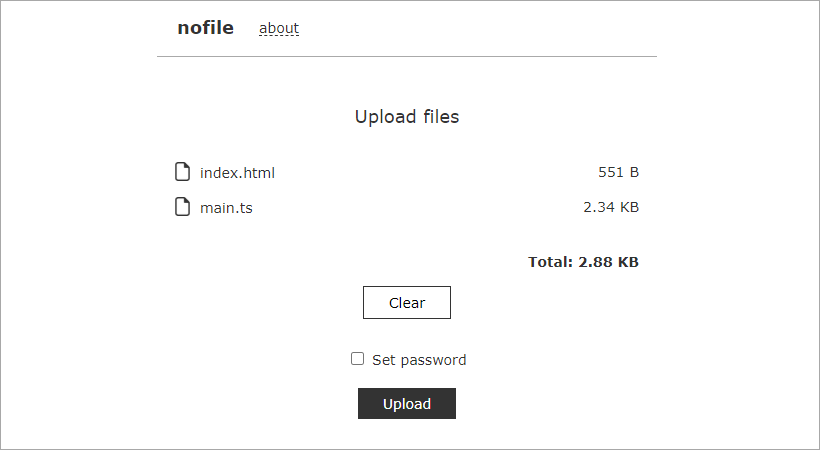

# nofile
Simple file sharing web service. Designed with Yii 2.

## Install
```docker-compose up --build```

Open http://localhost

Home: ```/```  
Admin: ```/admin```

Config file: ```./config/params.php```

## Screenshots
